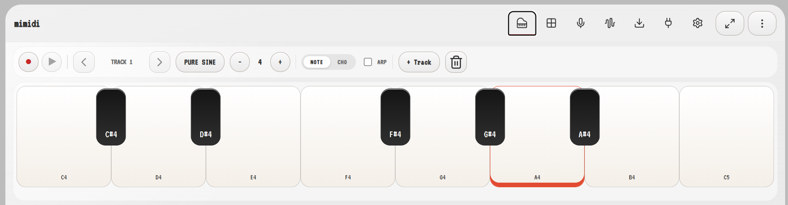
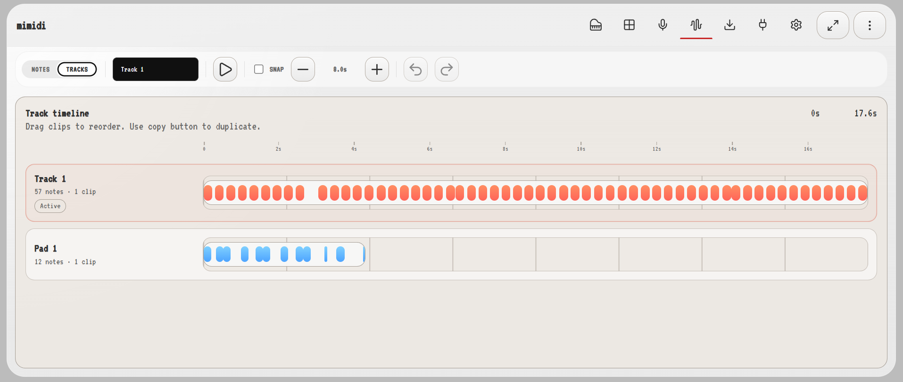
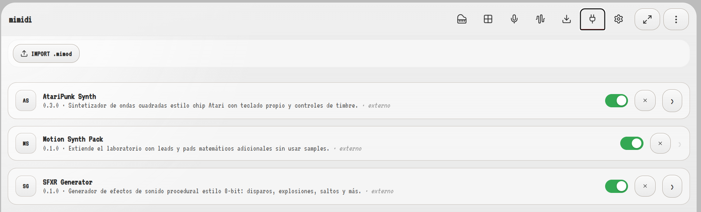
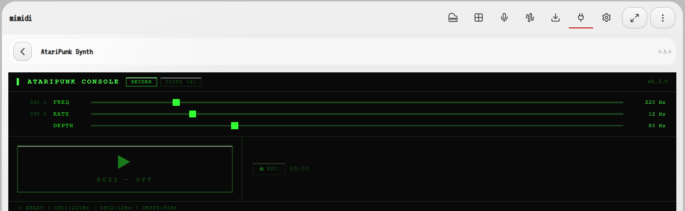
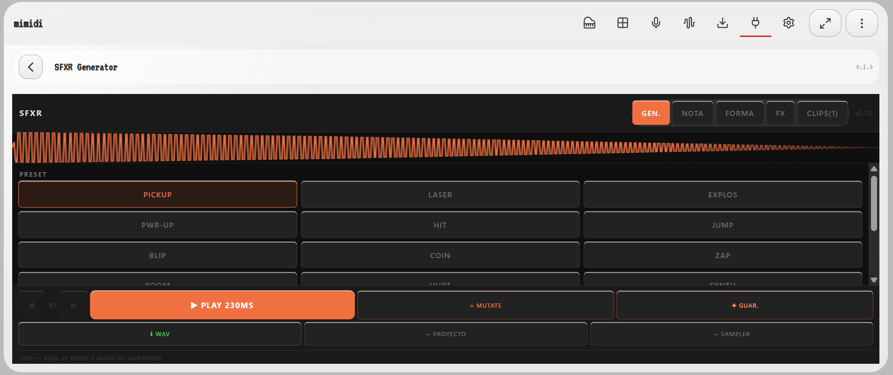

# MiMIDI

A **mobile-first** modular music lab built on mathematical synthesis and a plugin architecture. Designed to create, record, and play musical ideas from your phone — with a dedicated browser experience on the way.

> The UI is bilingual — Spanish and English. The codebase and plugin API are in English.

---

<!-- Screenshots -->

**🎹 Piano** — Play and record notes with velocity. Switch between single note and chord mode.



---

**🎛 Edit** — Multi-track timeline. Drag clips, adjust timing, undo/redo.



---

**🔌 Plugin manager** — Install, enable and open plugins from `.mimod` files. Three demo plugins included out of the box.



---

**🟢 AtariPunk Synth** — Plugin workspace. Square-wave chip synth with oscillators and clip recorder.



---

**🟠 SFXR Generator** — Plugin workspace. Procedural 8-bit sound effects with presets, mutate and WAV export.



---

## What is MiMIDI?

MiMIDI is a mobile-first music laboratory. The primary target is phones and tablets; the desktop browser experience is secondary. Its core deliberate constraint: **all sound comes from mathematical synthesis** — oscillators, envelopes, and parameters — not sample banks. This keeps the core lightweight and fast on mobile hardware, while samples and complex instruments arrive later as plugins.

The project follows **Screaming Architecture**: the folder structure speaks about music, MIDI, audio, instruments, timeline, transport, and plugins — not about React.

---

## Features

### Core
- Multi-track recording with MIDI events
- Piano roll timeline — move, resize, snap, undo/redo (Ctrl+Z / Ctrl+Y)
- Mathematical instruments (sine, square, sawtooth, triangle, noise) with ADSR envelopes
- WAV export of the current mix
- Import / export project as JSON
- SMC Pad — 8 synthetic percussion sounds with velocity via Y position
- Arpeggiator mode
- Master volume control
- Persistent local state (IndexedDB)

### Plugin system
- Install plugins from `.mimod` files (ZIP-based format)
- Two plugin types: **instrument packs** (no build step) and **React workspaces** (full UI)
- Developer mode: load a plugin directly from a local folder (Chrome/Edge)
- Typed SDK available as `mimidi-plugin-sdk.d.ts`
- Plugin API exposes: audio playback, project/transport state, clip storage, notifications

### Demo plugins included
| Plugin | Type | Description |
|--------|------|-------------|
| **Motion Synth Pack** | Instrument pack | Additional mathematical leads and pads |
| **AtariPunk Synth** | Workspace | Square-wave chip synth with its own keyboard |
| **SFXR Generator** | Workspace | Procedural 8-bit sound effects (shots, jumps, explosions) |

---

## Getting started

```bash
npm install
npm run dev
```

Open `http://localhost:5173`.

| Command | Description |
|---------|-------------|
| `npm run dev` | Dev server with HMR |
| `npm run build` | Production build |
| `npm run preview` | Preview the production build |
| `npm run lint` | Run ESLint |
| `npm test` | Run unit tests (Vitest) |

---

## Plugin development

### Install a plugin
Drag a `.mimod` file onto the plugin list, or use **IMPORT .mimod** in the lab panel.

### Build one of the demo plugins
```bash
# Instrument pack (no build step needed — just pack)
node scripts/build-mimod.mjs motion-synth-pack

# React workspace plugin
node scripts/build-plugin.mjs ataripunk
node scripts/build-plugin.mjs sfxr
```

Output: `public/demo-plugins/<id>/<id>.mimod`

### Plugin format

A `.mimod` file is a ZIP with two entries:

```
my-plugin.mimod (ZIP)
├── manifest.json
└── index.js        ← single ESM bundle
```

**manifest.json** minimum fields:
```json
{
  "id": "my-plugin",
  "name": "My Plugin",
  "version": "0.1.0",
  "description": "What it does.",
  "author": "Your Name",
  "license": "MIT",
  "entryPoint": "index.js",
  "mimidiVersion": ">=1.0.0",
  "permissions": []
}
```

**Plugin definition** (TypeScript):
```typescript
import type { MiMIDIPluginDefinition } from "./mimidi-plugin-sdk"

const plugin: MiMIDIPluginDefinition = {
  id: "my-plugin",
  name: "My Plugin",
  version: "0.1.0",
  description: "...",
  enabledByDefault: true,

  // Option A — instrument pack
  instruments: {
    instruments: [ /* MathematicalInstrument[] */ ]
  },

  // Option B — React workspace
  workspace: {
    component: MyWorkspaceComponent,
  }
}

export default plugin
```

**Plugin API** available inside the workspace component:

```typescript
// Received as prop: api: MiMIDIPluginAPI
api.audio.playNote("C4", instrumentId, 0.5)
api.transport.isPlaying
api.transport.onPlay(() => { /* ... */ })
api.project.getBPM()
api.session.sendOutput(output)
api.session.storeClip(blob, "name", duration)
api.ui.notify("Done!")
```

Download the full type declarations: **SDK .d.ts** button in the lab panel, or at `/mimidi-plugin-sdk.d.ts`.

---

## Architecture

```
src/
  application/        ← use-cases, coordination
  engine/
    audio/            ← synthesis, oscillators, envelopes, WAV export
    midi/             ← events, recording, playback
  features/
    lab/              ← plugin registry, lab UI
    edit/             ← multi-track editor, piano roll
    project/          ← project list, persistence
    perform/          ← performance view
    sampler/          ← SMC pad
    settings-view/
  domain/             ← musical types (Note, Track, Clip, Project…)
  shared/             ← UI components, hooks, i18n

public/
  demo-plugins/       ← plugin source + built .mimod files
    ataripunk/
    sfxr/
    motion-synth-pack/

docs/                 ← internal technical documentation
wiki/                 ← public documentation
scripts/              ← plugin build tools
```

**Key principles:**
- React is the presentation layer — no synthesis logic inside components
- MIDI = musical intention and events; Audio = sound generation
- Core stays small: samples and complex instruments belong in plugins
- Plugins are extensions, not patches — the API is designed to stay stable

---

## Tech stack

| | |
|---|---|
| Framework | React 19 + TypeScript |
| Build | Vite 8 |
| Audio | Web Audio API |
| Plugin bundler | esbuild |
| Plugin storage | IndexedDB + fflate (ZIP) |
| Icons | lucide-react |
| Tests | Vitest + Testing Library |

---

## Documentation

| | |
|---|---|
| [`wiki/`](wiki/00-README.md) | Public docs — architecture, plugin guide, roadmap |
| [`docs/`](docs/00-README-DOCS.md) | Internal technical memory — decisions, context, dev log |

---

## License

MIT
